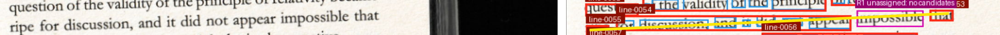
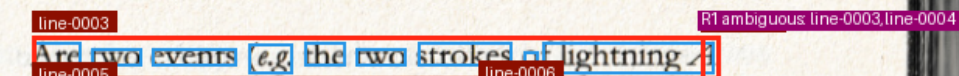
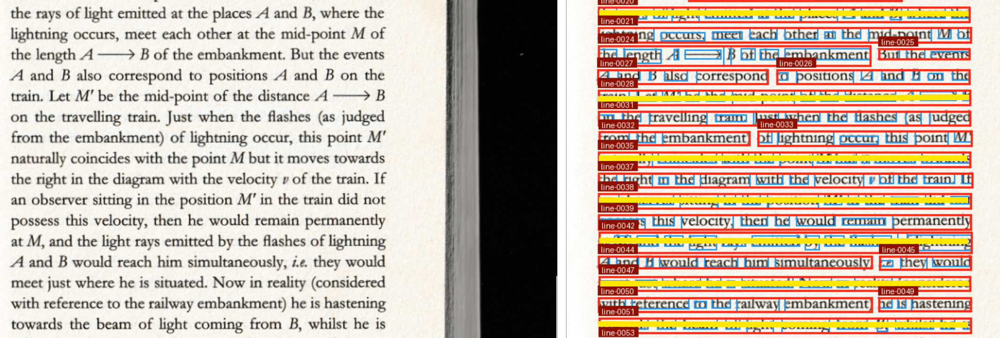
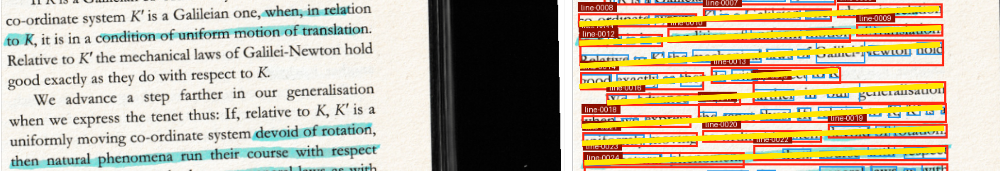

- stella_maris_pdf06_dense-dialogue / left
  - between `line-0027` and `line0028` theren is an ENTIRE line missed. `line-0026` to `line-0028` bounding boxes look massive compared to the others on the image—looks like highlighting is possibly causing this
- the following images have an insane amount of noise on the edges (excess line recognition on nothing)—seems to be on images with visible gutter or page edges:
  - relativity_pdf10_pp26-27 / left
  - relativity_pdf17_pp40-41 / right
  - relativity_pdf23_pp52-53 / left
  - relativity_pdf23_pp52-53 / right
  - 
- resuduals on image `relativity_pdf10_pp26-27 / left`:
  - lines seem to go L to R but then swap and go R to L randomly in the middle—good all the way to `line-0016` then `line-0017` to `line-0025` go R to L then at `line-0026` goes back to L to R—does the resulting output serialize this way? because if so, its mixing words around. Also looks like its contributing to the confusion of the residuals.
  - R1 token-0213: `system` is the only token not actually assigned a line.... 
  - R2 token-0216: `that` is clearly inside `line-0047`
  - R3 token-0217: `the` is clearly inside `line-0047`
  - R4 token-0226: `with` is clearly inside `line-0049`
  - R5 token-0227: `respect` is clearly inside `line-0049`
- residual on image `relativity_pdf10_pp26-27 / right`:
  - looks like the L to R swapping contributing as well `line-0053` to `line-0055` should be continuous and L to R, not R to L, and should contain residual R1 token-0246 `impossible`, which is unassigned.
  - 
- residual on image `relativity_pdf17_pp40-41 / right`
  - R1 token-0023: `A` clearly inside `line-0003` 
  - 
- common line breakage on slanted images, also contains the images with residuals and L to R/R to L swapping
  - 
  - 
